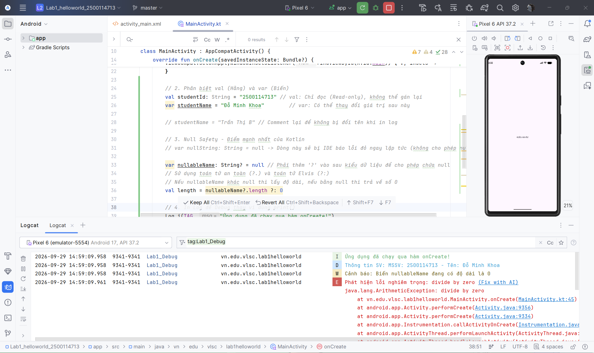

# Lab 1: Hello World & Cú pháp cơ bản Kotlin

Dự án bài tập **Lab 1** môn Lập trình Di động Android bằng ngôn ngữ Kotlin.

---

## 👤 Thông tin sinh viên

- **Họ và tên:** Đỗ Minh Khoa
- **Mã số sinh viên (MSSV):** 2500114713
- **Lớp / Trường:** VLSC


````
## 🚀 Nội dung thực hành trong Lab 1
Dự án giới thiệu các khái niệm và cú pháp nền tảng khi phát triển ứng dụng Android bằng Kotlin:

1. **Khởi tạo Activity & Edge-to-Edge Layout**:
   - Sử dụng `AppCompatActivity` và `enableEdgeToEdge()` để tối ưu không gian hiển thị trên màn hình tràn viền.
   - Sử dụng `ViewCompat.setOnApplyWindowInsetsListener` để tự động tính toán padding theo System Bars (thanh trạng thái và thanh điều hướng).

2. **Khai báo Biến (`val` vs `var`)**:
   - `val` (Value): Khai báo hằng số / biến chỉ đọc (read-only), không thể gán lại giá trị.
   - `var` (Variable): Khai báo biến có thể thay đổi giá trị sau này.

3. **An toàn bộ nhớ Null (Null Safety)**:
   - Sử dụng kiểu dữ liệu Nullable (`String?`) for phép chứa giá trị `null`.
   - Sử dụng toán tử gọi an toàn (`?.`) kết hợp toán tử Elvis (`?:`) để xử lý giá trị mặc định khi biến bị `null`.

4. **Ghi Log hệ thống (`Logcat`)**:
   - Sử dụng lớp `android.util.Log` với hằng số `TAG = "Lab1_Debug"` để kiểm tra luồng ứng dụng:
     - `Log.i()` - Thông tin chung (Info)
     - `Log.d()` - Dữ liệu debug (Debug)
     - `Log.w()` - Cảnh báo (Warning)
     - `Log.e()` - Lỗi hệ thống (Error)

5. **Xử lý ngoại lệ (`try-catch`)**:
   - Bắt lỗi khi thực hiện các phép tính nguy hiểm (như chia cho 0) để ứng dụng không bị đột ngột dừng (crash app).

---

## 📁 Cấu trúc dự án

```text
Lab1_helloworld_2500114713/
├── app/
│   ├── src/
│   │   ├── main/
│   │   │   ├── java/vn/edu/vlsc/lab1helloworld/
│   │   │   │   └── MainActivity.kt       # Activity chính chứa code logic & bài tập Kotlin
│   │   │   ├── res/
│   │   │   │   └── layout/
│   │   │   │       └── activity_main.xml # Layout giao diện màn hình chính
│   │   │   └── AndroidManifest.xml
│   │   └── test/
│   └── build.gradle.kts
├── build.gradle.kts
├── settings.gradle.kts
└── README.md
```

---

## 🛠️ Yêu cầu môi trường & Cách chạy

- **Android Studio:** Jellyfish / Koala / Ladybug hoặc mới hơn.
- **JDK:** OpenJDK 17 trở lên.
- **Android SDK:** Compile SDK 34/35, Min SDK 24.

### Các bước chạy dự án:
1. Mở dự án trong **Android Studio**.
2. Chờ Gradle hoàn tất quá trình Sync (`Gradle Sync`).
3. Chọn thiết bị giả lập (Emulator) hoặc thiết bị thật kết nối qua ADB.
4. Nhấn **Run** (`Shift + F10` hoặc nút ▶️) để khởi chạy ứng dụng.
5. Mở cửa sổ **Logcat** trong Android Studio, lọc theo từ khóa `Lab1_Debug` để xem các dòng Log kết quả.
