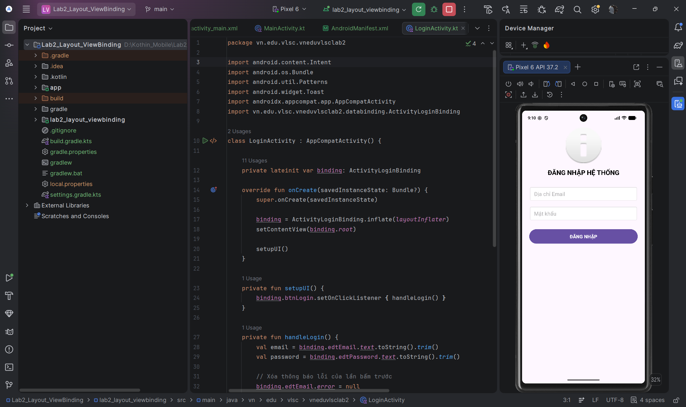

# Bài tập Thực hành - Phát triển ứng dụng di động

Repository này chứa mã nguồn các bài Lab thực hành môn Phát triển ứng dụng di động.

## 📂 Cấu trúc Repository

### [Lab 2: Thiết Kế Giao Diện XML & ViewBinding](./lab2_layout_viewbinding)
Bài thực hành về thiết kế giao diện bằng ConstraintLayout và ViewBinding. 

**Nội dung:**
- Thiết kế màn hình Login (Có Validation).
- Thiết kế màn hình Profile.
- Đảm bảo layout responsive (hoạt động tốt trên màn hình điện thoại nhỏ, lớn và khi xoay ngang).
- Sử dụng ConstraintLayout phẳng (không dùng Nested Layout).
- Chuyển dữ liệu giữa các Activity thông qua Intent.

**Hình ảnh Demo (Lab 2):**

